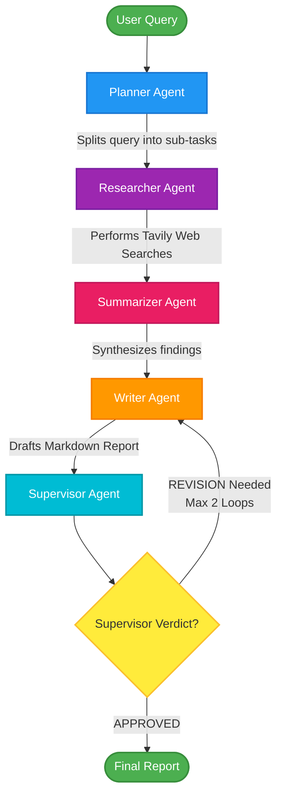

# 🤖 AutoResearch Agent

[](https://www.python.org/)
[](https://fastapi.tiangolo.com/)
[](https://streamlit.io/)
[](https://github.com/langchain-ai/langgraph)
[](https://groq.com/)
[](https://tavily.com/)

A multi-agent AI research system built with LangGraph, LangChain, FastAPI, and Streamlit. Given any research query, 5 specialized agents autonomously plan, search, summarize, write, and review a comprehensive research report.

---

## 🏗️ Architecture

Below is the stateful execution flow of your multi-agent architecture:



- **Planner Agent** — breaks query into focused sub-tasks
- **Researcher Agent** — searches web in parallel using Tavily
- **Summarizer Agent** — condenses findings in parallel
- **Writer Agent** — compiles structured report
- **Supervisor Agent** — reviews quality, loops back if needed

---

## 🛠️ Tech Stack
**LangGraph** · **LangChain** · **FastAPI** · **Streamlit** · **Groq** · **Tavily** · **Python**

---

## 🚀 How to Run
1. Clone the repo:
   ```bash
   git clone https://github.com/aryanmakwana1801/Autoresearch-Agent.git
   cd Autoresearch-Agent
   ```
2. Install dependencies:
   ```bash
   pip install -r requirements.txt
   ```
3. Add API keys to `.env` file in the root folder:
   ```env
   GROQ_API_KEY="your-groq-api-key"
   TAVILY_API_KEY="your-tavily-api-key"
   ```
4. **Terminal 1 (Backend API)**:
   ```bash
   cd autoresearch-agent
   python backend/main.py
   ```
5. **Terminal 2 (Frontend Dashboard)**:
   ```bash
   cd autoresearch-agent
   streamlit run frontend/app.py
   ```

---

## 🌟 Key Features
- **Parallel web search and summarization** (3x faster)
- **Supervisor feedback loop** for quality control
- **REST API backend** with FastAPI
- **Interactive Streamlit UI** with pulsing progress tracking
- **Downloadable research reports** in Markdown format

---
*Developed by **Aryan Makwana**. Powered by LangGraph & Groq.*
